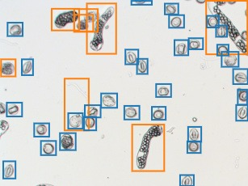

# Detecting Pollen Viability

Tool in development to take in microscope images of germinating pollen grains and compute viability:

https://nbviewer.jupyter.org/github/gregorybarber94/Detecting_Pollen_Viability/blob/master/Detecting_Pollen_Viability.ipynb

An object detection model was trained utilizing the tensorflow object detection api: (https://github.com/tensorflow/models/tree/master/research/object_detection) with Faster-RCNN to detect and classify 
germinated and ungerimated pollen grains. The model was trained on pollen grains imaged from various cycads 
and manually labeled utilizing labelImg (https://github.com/tzutalin/labelImg)
