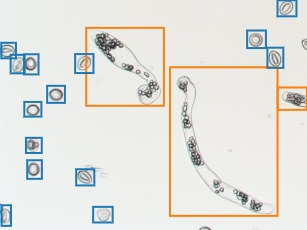

# Detecting Pollen Viability

Tool for computing Cycad pollen viability from microscope images of germinating pollen. 

 

## Summary

A Faster-RCNN object detection model was trained utilizing the [tensorflow object detection api](https://github.com/tensorflow/models/tree/master/research/object_detection) to detect and classify the germination status of pollen grains. The model was trained on pollen grains imaged from various cycads 
and manually labeled with [labelImg](https://github.com/tzutalin/labelImg).

## nbviewer link
https://nbviewer.jupyter.org/github/gbarber94/Detecting_Pollen_Viability/blob/master/Detecting_Pollen_Viability.ipynb
